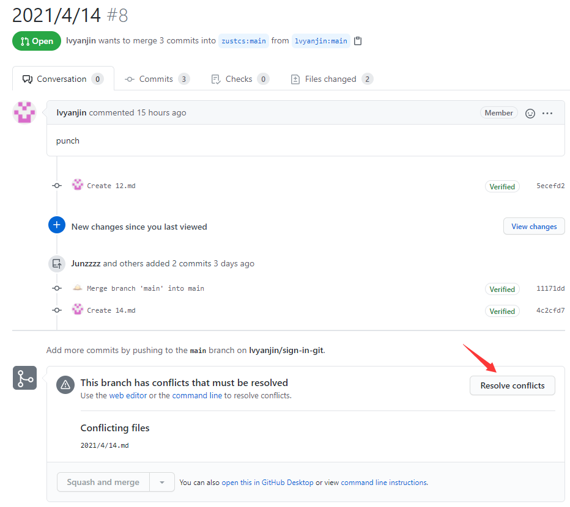

# 合并冲突

## 冲突是怎么产生的

如上图所示，有三个人针对版本`C1`做了3次不同的`commit`

当第一个人将代码合并到主分支时，`git`可以自动识别到新增的`C2`是直接继承自`C1`的

那么这便意味着，这次合并是针对版本`C1`做的修改，而合并的结果就是直接将`C1`的版本改为`C2`，如下图所示：

这时候，第二个人想要合并版本`C3`到主分支`main`时就会发现，`C3`不是继承自`C2`的，这种情况想要自动合并会带来很多困难。

假设有这么个情况，存在两个文件`A`和`B`，现在需要删除其中一个才能正常

这时候大家纷纷都来操作了

第一个人删除了一个文件`A`，但是第二个人没有删除`A`而是删除了`B`

那么合并`C2`和`C3`时，到底是删除`A`还是删除`B`，还是说都删除？

这种事情`git`是无法决定的，因为都是针对`C1`做的修改，因此在合并的时候要对所有修改再做一次确认

比如说，最终决定采纳第二个人的方案，那么合并的结果就是：

这里之所以新建了一个版本`C5`，而不是直接修改版本号到`C3`是因为可能同时融合了两个人的方案，这时候新增一个版本是最省力的。

## 解决冲突

这里有两种办法，较为简单的就是直接在`GitHub`上直接操作

### 方法一

点击`Resolve conflicts`

出现以下界面

只需要修改代码成为最终结果就行

然后点击`Mark as resolved`表示这个文件的冲突解决了，当然如果有多个文件的话需要重复这个过程

全部完成后，点击`Commit merge`

注意上面有行字，这意味着这次解决冲突产生的新版本是创建在`lvyanjin:main`这个分支下的

所以每次上传代码的时候，需要`git pull`一下来同步仓库的内容，不然直接创建修改又会出现上述的冲突

---

所有的冲突解决后，`git`就能识别到你的版本是继承自主分支版本做的修改，这时候就可以直接使用自动合并了

### 方法二

严格的来讲并不算一种方法，而是另外一个流程

可以在自己本地文件里新增一个`remote`地址，用来保存主仓库地址

每次修改先`pull`主仓库内容到本地，修改完后`push`到自己的仓库，然后再提交PR

这样基本不会出现需要手动解决冲突的情况

## 题外话

`GitHub`里列出了3种不同的合并，有兴趣可以仔细了解一下

这里推荐第二种，将`commit`记录打包成一个提交，这样主仓库的提交记录里不会显的比较杂乱，这也是用的比较多的方式

