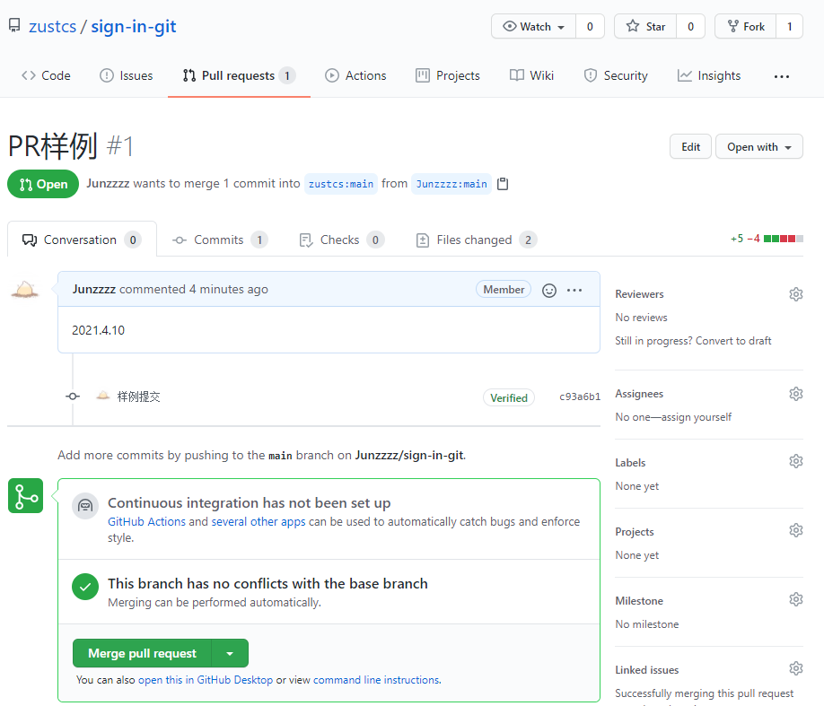
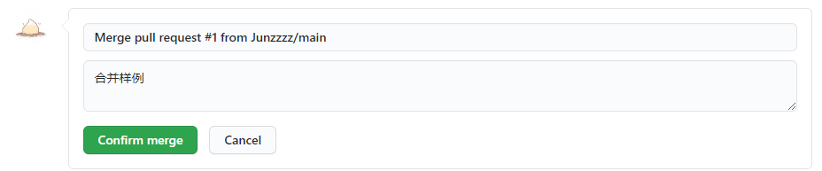

# 合并流程

进入`Pull requests`选项卡

点击绿色的`New pull request`

一般会自动分析要合并的内容，然后填写合并的说明，就会来到下面这个页面

如上图所示

`2021.4.10`是写合并的说明，比如你跟仓库管理者说：我修复了XXXBUG，用来解释你提交PR的原因

再下一行`样例提交`那块区域是你的`commit`记录，你可以好几次commit后一次性提交PR

`This branch has no conflicts with the base branch`指的是没有冲突的代码，可以自动合并，有冲突部分需要手动合并

然后点击绿色的`Merge pull request`

第一个框内填写的是`commit`信息，相当于用的`git commit -m "Merge pull request..."`

第二个框内填写的是说明

然后点`Confirm merge`就合并成功啦！